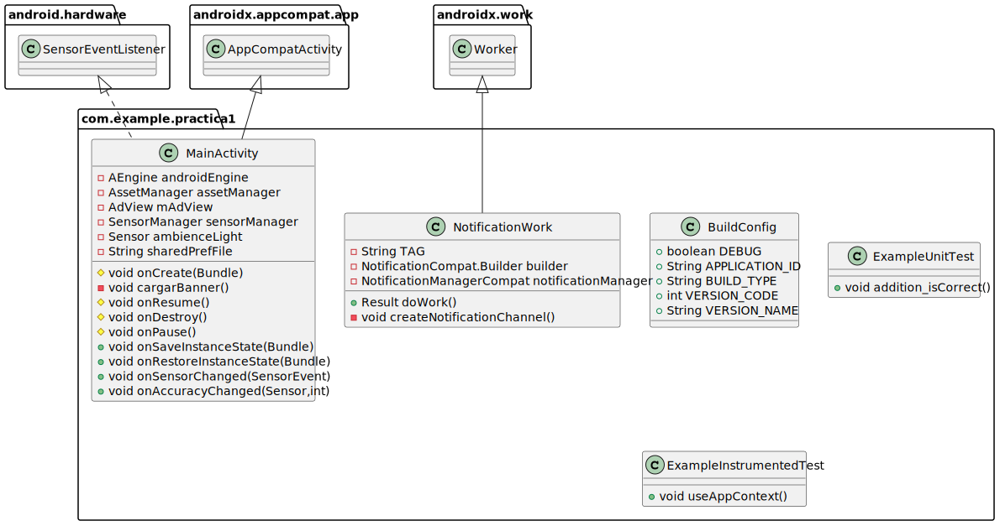
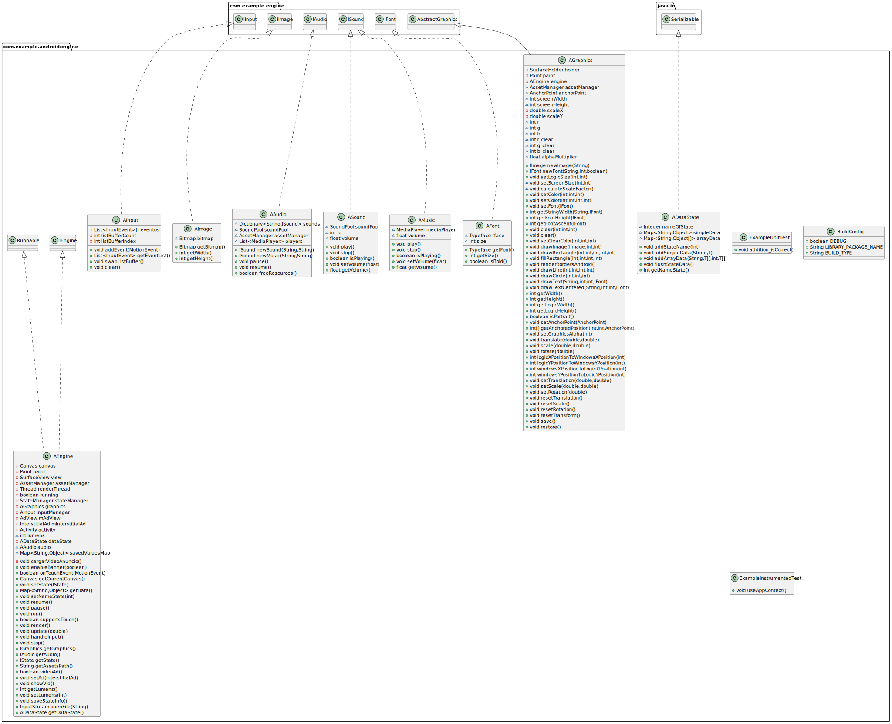
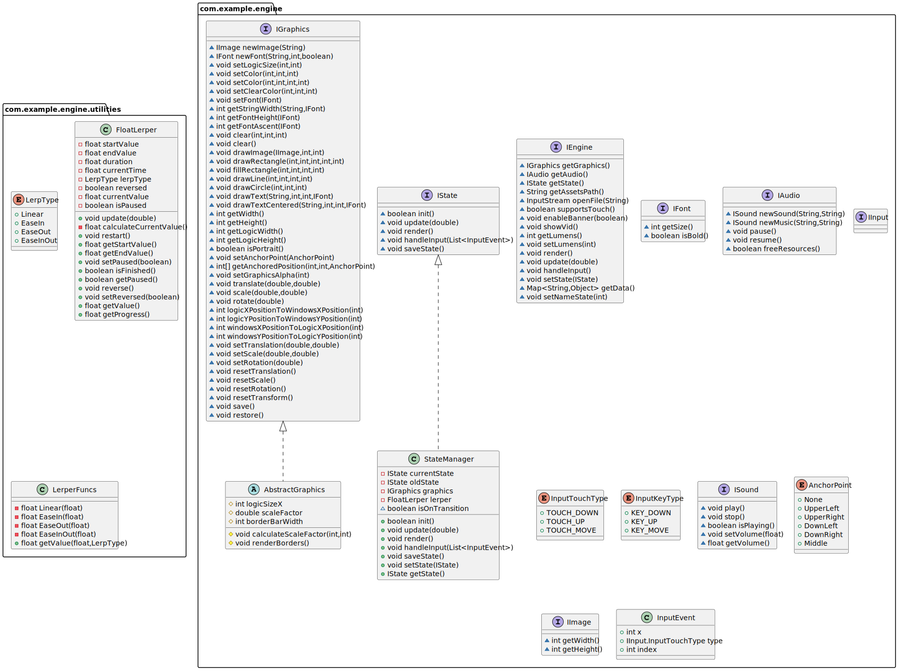
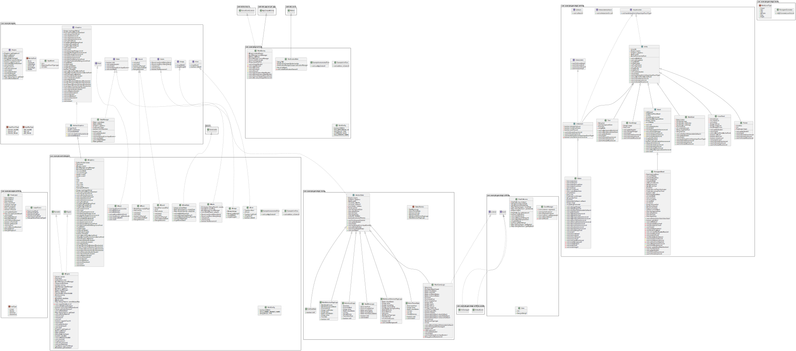

# Arquitectura

## Módulos

Tenemos 4 módulos. Engine, GameLogic, AndroidEngine y AndroidGame. 

# Progreso

El jugador puede elegir entre 2 modos de juego: Partida Rápida y Modo Historia. En modo partida rápida los niveles se generan al azar eligiendo 6 presets de tamaños. En modo historia hay 6 mundos, cada uno con 20 niveles. Los 5 primeros son 5x5, los 5 siguientes 10x10, los 5 siguientes 15x15 y los 5 últimos 20x20. Se puede jugar cualquier mundo, pero solo el primer nivel de cada uno estará desbloqueado, para desbloquear el siguiente será necesario superar el nivel anterior.

# Sensores

Hemos deducido que nuestro juego puede ser jugado tanto por jóvenes de día, como por adultos por la noche para desconectar del trabajo, por lo que hemos usado el sensor de luminosidad del dispositivo para mostrar un mundo especial por la noche y otro por el día. Esto significa que en la pantalla de selección de mundo solo se ven 5 mundos de los 6 que tiene el juego. Tras realizar diversas mediciones hemos estimado que la mejor cifra para distinguir esto son 50 lux. Si el sensor de luminosidad detecta que la luz es menor a 50 lux, se muestra el mundo nocturno, si es mayor, se muestra el mundo diurno. Esto permite jugar niveles del modo "Noche" en interiores que sean algo oscuros aún si es de día. En exteriores sería muy extraño que el sensor de luminosidad detecte menos de 50 lux, por lo que no se mostraría el mundo nocturno.

# Sistema de vidas

Para asegurar que el juego no sea demasiado fácil y el jugador pase más tiempo, hemos incorporado un sistema de vidas. Cada nivel permite fallar un máximo de 3 veces, tras lo cual se reinicia.

# Anuncios

Para monetizar el juego hemos optado por usar dos tipos de anuncios: Banners y recompensados. El banner aparece únicamente en la pantalla de inicio y es permanente. Los recompensados aparecen cuando en el juego se pulsa el botón de conseguir más vidas. Tras esto sale un anuncio y cuando el jugador lo termina de ver recibe una vida extra.

# Notificaciones:

En AndroidGame tenemos una clase llamada NotificationWok que se encarga de crear y mostrar la notificación. Dicha clase extiende Worker y sobreescribe el metodo doWork(). En la constructora creamos la notificación y el canal por el que se muestra. En doWork hacemos el notify. 

Esta clase es asociada a un PeriodicWorkRequest en MainActivity para que se muestre cada 15 minutos tras hacer enque en el WorkManager.

# Temas:

En AbstractState guardamos los colores (variables estáticas) que usaran los estados para pintar distintos objetos/partes de la pantalla. Este color es modificado desde el SelectThemeState en función del botón que haya seleccionado el jugador. Cada botón con excepción del primero/default está asociado a un mundo/cjto de niveles del modo historia. No es hasta que el jugador desbloquea un número específico de niveles (actualmente uno) que el botón correspondiente es desbloqueado, permitiendo así al jugador cambiar la paleta de colores. 

El desbloqueo de botones es controlado mediante un vector de booleanos estático  en AbstractState (uno bool por paleta y todos a false por defecto salvo el primero). Mediante un callback en MainGameLogic, se modifica el valor del bool correspondiente cuando se detecta que el jugador ha completado el número de niveles específico. SelectLevelLogic crea los botones dependiendo de los valores de dicho vector, permitiendo pulsar unicamente aquellos que están a True.

# Arquitectura

La arquitectura se basa en la ya realizada en la práctica anterior extendiendo la interfaz IEngine y por correspondencia AEngine, lo mismo para la parte gráfica. El toque largo lo gestionan las entidades, el motor no da soporta para detectar el toque largo. Hemos elegido 350 ms como tiempo para considerar un toque como largo debido a que es el tiempo que usan aplicaciones de google como gboard para detectar un toque largo.

A continuación mostramos los diagramas UML de cada proyecto. Estos diagramas han sido exportados en SVG por lo que se pueden ampliar sin perder calidad.

# UML AndroidGame

# UML AndroidEngine

# UML GameLogic

# UML Engine

# UML Proyecto

