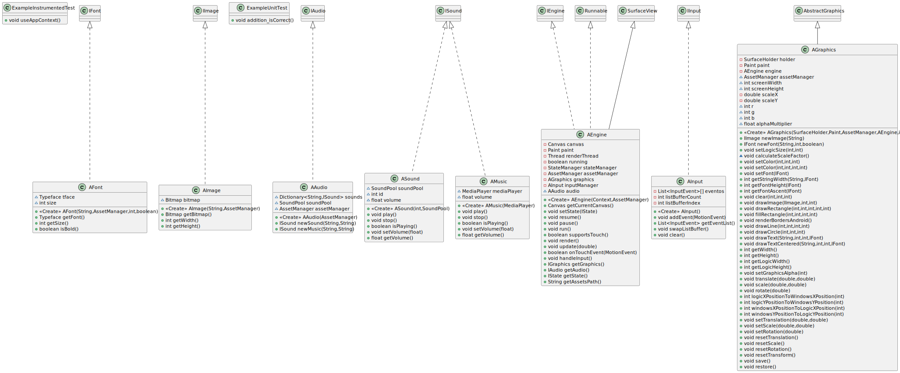
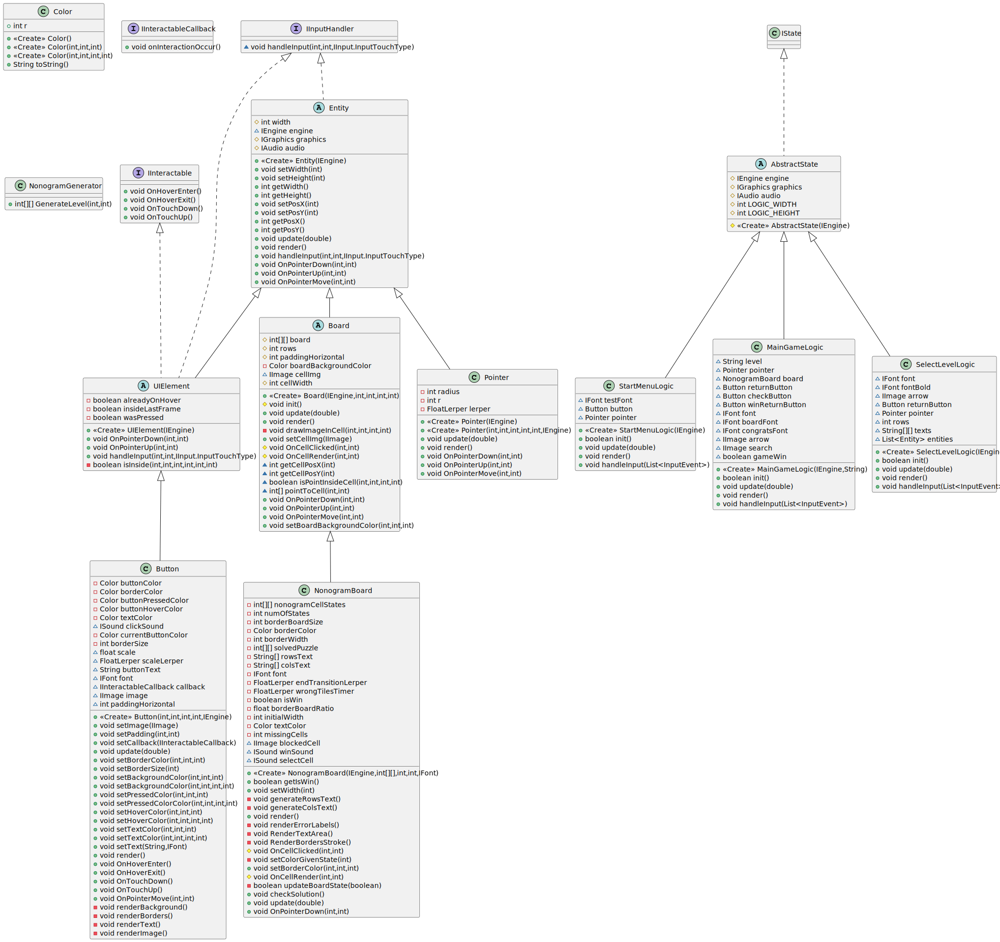

# Arquitectura

## Módulos

Tenemos 6 módulos. Engine, GameLogic, DesktopEngine, DesktopGame, AndroidEngine y AndroidGame.

### Funcionamiento general del engine

DesktopGame inicializar la lógica y usa DesktopEngine, que implmenta Engine. AndroidGame inicializa la lógica y usa AndroidEngine, que implementa Engine.

La lógica no conocen a los módulos de ``Android`` ni ``Desktop``. La lógica se comunica con el motor a través de las interfaces del módulo de Engine. El módulo de Engine proporciona interfaces para controla gráficos, input, imágenes, textos, sonidos, estado (lógica) y además proporciona una clase StateManager para facilitar el cambio de estados. También proporciona la utilidad FloatLerper que usa StateManager para facilitar animaciones y timers simples.

Tanto DesktopEngine como AndroidEngine usan un patrón de buffer para gestionar el input y evitar problemas de concurrencia. En cada handleInput() se pasa la lista de InputActual al estado y justo tras eso se cambia por la siguiente del buffer. El buffer puede tener cualquier tamaño, actualmente está a 2.

Por diseño y para facilitar las cosas al programador, el punto de pivote de todos los objetos es el centro salvo para el texto, que tiene métodos para ser dibujado desde la esquina superior izquierda o desde el centro por conveniencia.

Este es el diagrama UML del módulo de Engine (ver en siguiente página):

Diagrama UML del módulo de DesktopEngine (ver en siguiente página):

Diagrama UML del módulo de AndroidEngine

### Funcionamiento general de la lógica

La lógica implementa la interfaz IState de Engine. Además hemos creado una capa (AbstractEngine) ya que los constructores de todos los estados son iguales, de esta forma evitamos repetir código.

Hemos creado interfaces IInteractable y clases como UIElement para facilitar la creación de elementos. Con estos pudimos crear botones que soportan imágenes con padding y el tablero, que es una clase abstracta que usa NonogramBoard para implementar el juego en sí.

Esta es la estructura de la lógica:

Diagrama UML del proyecto completo:

# Opcionales

- Fade In y Fade Out: Se ha implementado en el StateManager: Se usa en el cambio de estados para hacer un cross fade entre pantallas.
- Opción de niveles en los que el tablero no sea cuadrado: Gracias a nuestra arquitectura fue posible implementar cualquier tamaño de tablero. Actualmente el juego soporta los tableros que aparecen en el PDF de la práctica.